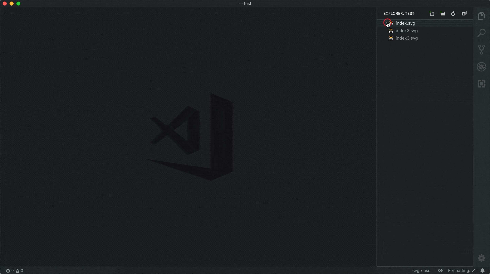

   

# Svg Preview for VSCode

<!-- TODO need to figure out why animation is restarted so often -->
<!-- TODO work in html -->
<!-- TODO update content when just opened -->
<!-- TODO handle active text editor before extension is activated -->
<!-- TODO vscode live share -->
<!-- TODO allow custom styles instead of checkerboard pattern -->

## Features

- Live editing of svg files
- Panning of the preview
- Zooming (currently work in progress)
- Ability to automatically open preview (can be enabled via settings)
- Ability to change background of the preview

## Settings

| Property | Description | Default |
| --- | --- | --- |
| svgPreview.autoOpen | Automatically open the preview when an svg file is opened | `false` |
| svgPreview.background | The background of the preview | `"transparent"` |
