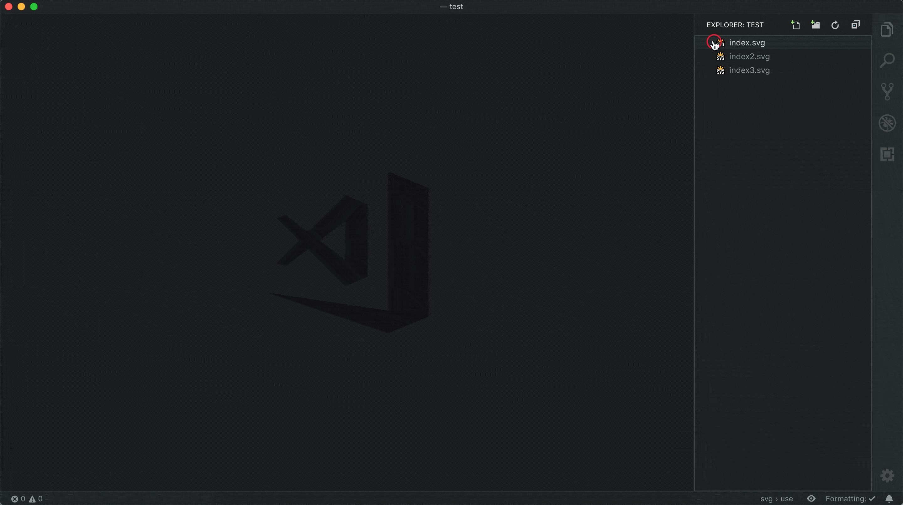
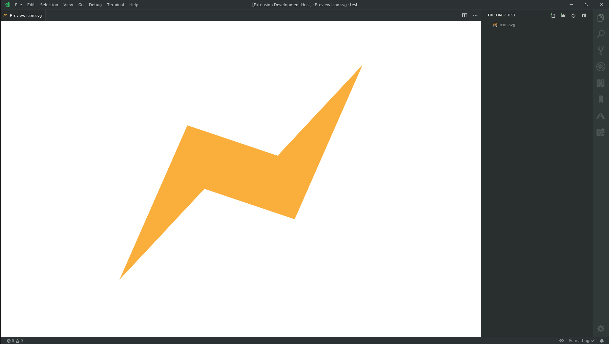
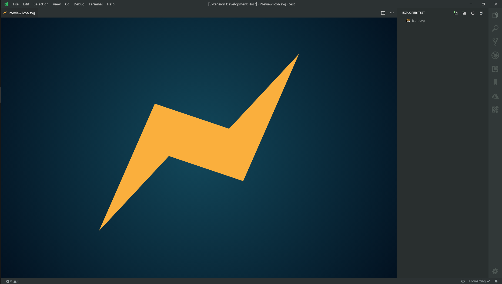
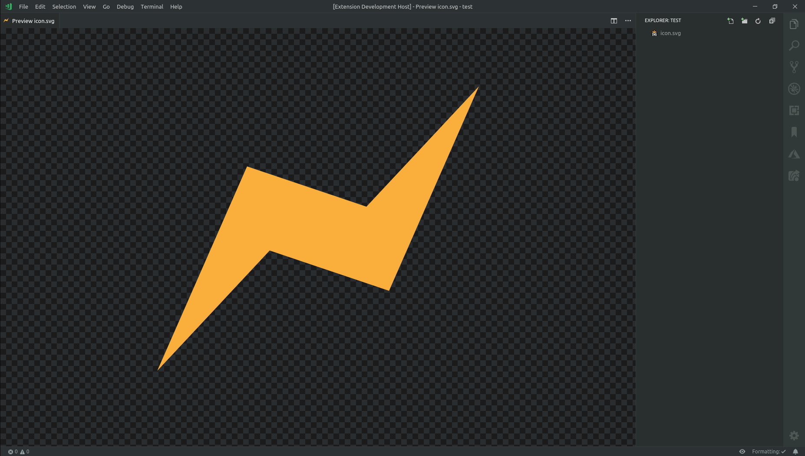

[](https://travis-ci.com/SimonSiefke/vscode-svg-preview) [](https://marketplace.visualstudio.com/items?itemName=SimonSiefke.svg-preview) [](https://renovatebot.com/)

# Svg Preview for VSCode



<!-- TODO need to figure out why animation is restarted so often / prevent unnecessary updates -->
<!-- TODO update content when just opened / handle active text editor before extension is activated-->
<!-- TODO vscode live share -->
<!-- TODO rename reset to reload? -->
<!-- TODO don't zoom/pan outside of the window -->
<!-- TODO improve external css -->
<!-- TODO add tests -->
<!-- TODO make packages more independent of each other (eslint, tsconfig etc.) -->
<!-- TODO setting for scale-to-fit or size of viewBox -->
<!-- TODO better demo gif -->
<!-- TODO bug with commented out </svg> inside html/js etc -->
<!-- TODO bug open svg, open preview, close svg, open other svg (title changes), switch to preview -> content not updated -->

## Features

- Live editing of svg files and svg's inside files
- Panning and zooming of the preview

## Commands

- Svg Preview: Open Preview to the Side
- Svg Preview: Open Preview
- Svg Preview: Reset Preview

## Settings

| Property | Description | Default |
| --- | --- | --- |
| svgPreview.autoOpen | Automatically open the preview when an svg file is opened | `false` |
| svgPreview.style | Custom style for the preview | `{}` |

## How to use the `svgPreview.style` setting

You can change the background color:



```json
{
  "svgPreview.style": {
    "html": {
      "background": "white"
    }
  }
}
```

Or make a gradient background (note that you need to use `-webkit` prefix radial gradients):



```json
{
  "svgPreview.style": {
    "html": {
      "background": "-webkit-radial-gradient(center, circle cover, hsl(195, 80%, 20%) 0%,hsl(220, 100%, 5%) 100%)"
    }
  }
}
```

Or you can make a checkerboard background:



```json
{
  "svgPreview.style": {
    "html": {
      "background-position": "0 0, 13px 13px",
      "background-size": "26px 26px",
      "background-image": "linear-gradient(45deg,  #141414 25%, transparent 25%, transparent 75%, #141414 75%, #141414), linear-gradient(45deg, #141414 25%, transparent 25%, transparent 75%, #141414 75%, #141414)"
    }
  }
}
```
